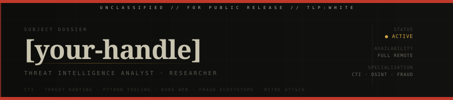

**Threat Intelligence Analyst** — tracking adversaries across criminal underground ecosystems, building tooling that operationalizes intelligence at scale.

---

### What I do

- Monitor dark web markets, fraud ecosystems, and criminal infrastructure
- Enrich and correlate IOCs across open-source and commercial feeds
- Map adversary behaviour to MITRE ATT&CK and produce finished intelligence
- Build Python tooling that automates the repetitive parts of CTI work

---

### Currently working on

- **IOC Enrichment Framework** — modular Python tool for automated IOC enrichment via VirusTotal, AbuseIPDB, OTX, URLhaus · MISP export · CLI-first · [View on GitHub](https://github.com/Cineeeski/ioc-enricher)

---

### Stack

---

### Writing & Research

- 📄 **The Secret Scriptorium: A Medieval Tale of the Shadow Shop That Forged Identities** — Investigation into an underground document fraud marketplace · [Read on Yarix Labs](https://labs.yarix.com/2026/05/the-secret-scriptorium-a-medieval-tale-of-the-shadow-shop-that-forged-identities/)
- 🌐 Portfolio & full research archive → **[cineeeski.github.io](https://cineeeski.github.io)**

---

### Certifications

| | |
|---|---|
| CTIA | Certified Threat Intelligence Analyst · EC-Council · April 2025 |

---

### Contact

